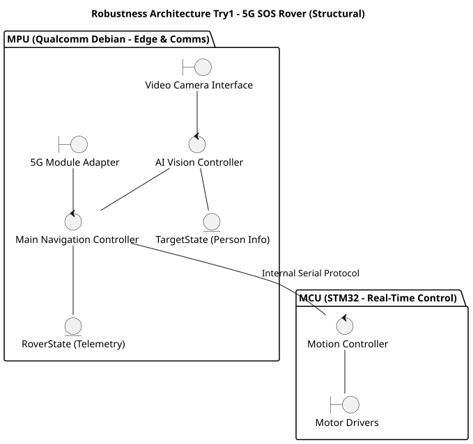
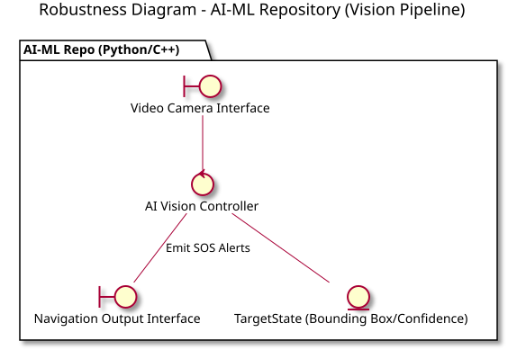
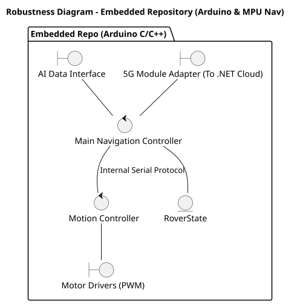
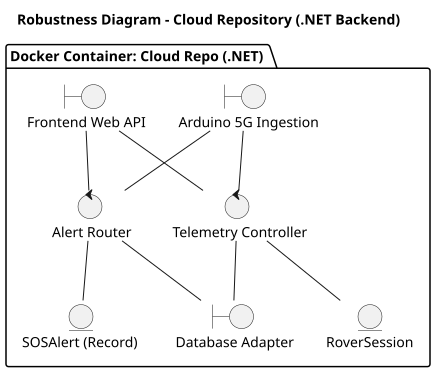
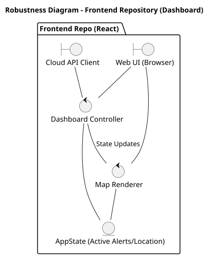
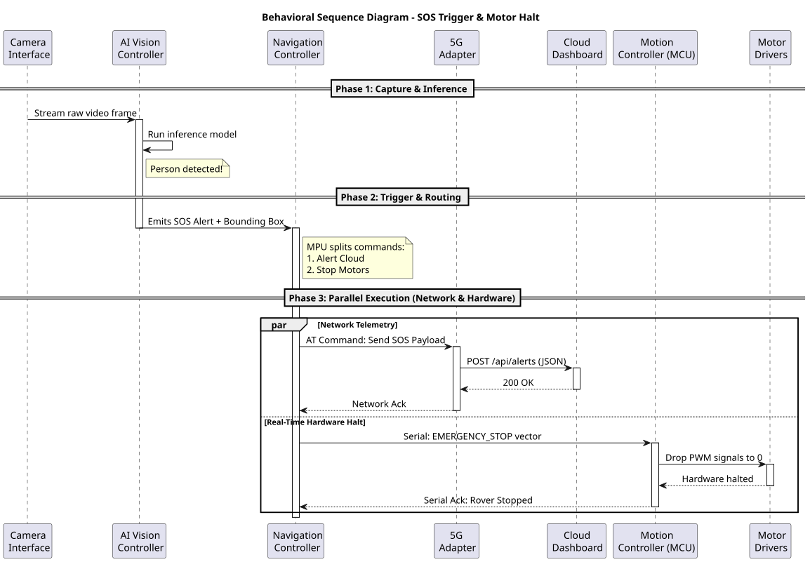

# 5G SOS Rover - System Architecture

**Author:** András-Károly Teodorovits  
**Date:** July 2026  
**Status:** Initial Draft (Issue #1)

## Overview
This document defines the software architecture for the 5G SOS Rover. Our documentation strictly separates structural modeling (components and boundaries) from temporal/behavioral modeling (execution over time). 

---

## 1. System-Level Architecture (Structural)

The diagram below represents the high-level **Structural Architecture** using the Robustness (Boundary-Control-Entity) pattern across our dual-processing hardware. 

---

## 2. Component-Level Architecture (Repo-Specific)

To allow teams to work independently, the system architecture is decomposed into four repository-specific structural maps. These dictate the strict boundaries and entities for each development squad.

### AI-ML Repository (Vision Pipeline)
Responsible for computer vision inference.

### Embedded Repository (Arduino & Nav)
Responsible for hardware control (STM32/Arduino) and navigation routing.

### Cloud Repository (.NET Backend)
Containerized Docker environment handling 5G ingestion and data persistence.

### Frontend Repository (React Dashboard)
Web application for the human operator.

---

## 3. Behavioral Architecture (Sequence)

The following sequence details the chronological execution of an SOS event, demonstrating how the MPU parallelizes external network alerts and internal hardware control.

### Execution Timeline
1. **Inference:** The `AI Vision Controller` continuously polls video frames and runs local inference.
2. **Event Trigger:** Upon target detection, an alert is routed to the `Navigation Controller`.
3. **Parallel Dispatch:**
   * **Cloud Route:** The navigation brain pushes a JSON payload through the `5G Adapter` to the external `Cloud Dashboard`.
   * **Hardware Route:** Simultaneously, an emergency halt vector is sent over the internal serial interface to the `Motion Controller` (MCU) to immediately drop motor PWM signals.

---

## 4. Integration Protocols

* **MPU <-> MCU Communication:** Handled via an internal serial protocol (packet structure and baud rate to be defined).
* **AI-ML <-> Embedded / Navigation:** The `AI Vision Controller` updates the `TargetState` entity, which the `Navigation Controller` polls to adjust movement vectors.

---
**Changelog:**
* *v0.2 - Added component-level BCE architectural decomposition for all 4 repositories.*
* *v0.1 - Initial draft: Added system-level BCE structural definition and SOS behavioral sequence diagrams.*